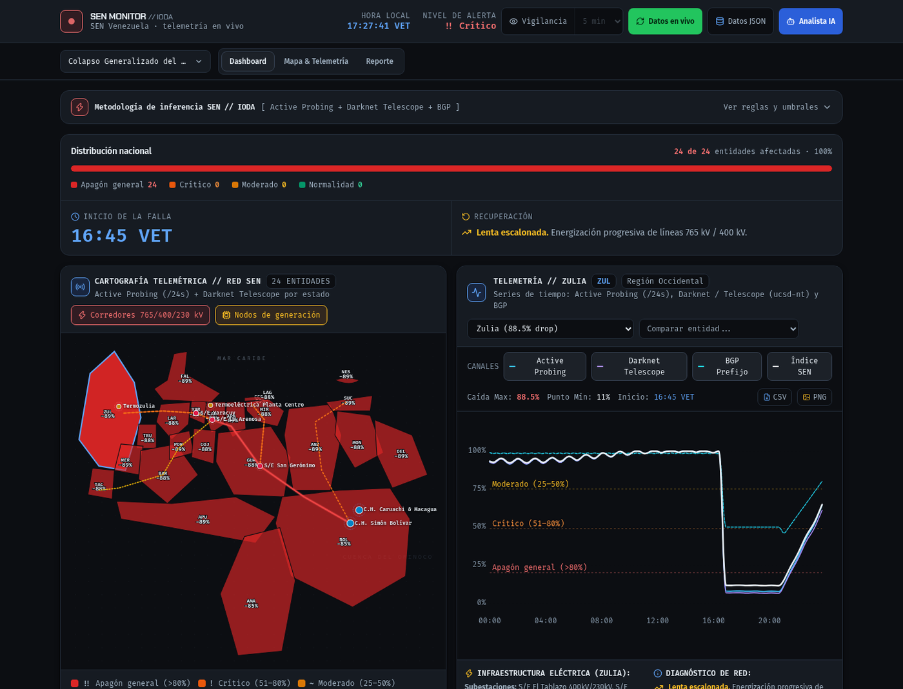

<div align="center">

# SEN Monitor

**Inferencia de apagones del Sistema Eléctrico Nacional de Venezuela a partir de telemetría de IODA**

Detecta, clasifica y reporta apagones en las 24 entidades federales Venezuelanas cruzando *Active Probing*, *Darknet Telescope* y prefijos *BGP*. Interfaz en español, análisis por umbrales y respaldo de IA con Gemini.

[](https://nodejs.org)
[](https://react.dev)
[](https://vite.dev)
[](https://www.typescriptlang.org)
[](https://tailwindcss.com)
[](#licencia)

</div>

---



<div align="center"><sub>Distribución nacional de severidad, cartografía por entidad y serie temporal con guías de umbral.</sub></div>

---

## Contenido

- [Qué hace](#qué-hace)
- [Cómo funciona la inferencia](#cómo-funciona-la-inferencia)
- [Arquitectura](#arquitectura)
- [Sistema de diseño](#sistema-de-diseño)
- [Puesta en marcha](#puesta-en-marcha)
- [Scripts](#scripts)
- [Despliegue](#despliegue)
- [Limitaciones](#limitaciones)
- [Licencia](#licencia)

## Qué hace

| Capacidad | Detalle |
|---|---|
| **Cartografía nacional** | Las 24 entidades federales en SVG, con severidad por estado y drilldown de telemetría. |
| **Telemetría en vivo** | IODA (Georgia Tech) vía proxy propio: sin CORS, whitelist de entidades, timeout de 15 s, caché de 5 min y deduplicación en vuelo. |
| **Motor de inferencia** | Línea base por percentil, inicio de anomalía, dinámica de recuperación y dos filtros de falsos positivos. |
| **Reporte estructurado** | Resumen ejecutivo, clasificación por estado, análisis de restitución y alerta comunitaria. Exporta a **Markdown, JSON, CSV** e **imprime a PDF** con tema claro. |
| **Analista IA** | Consultas técnicas sobre la topología del SEN con Gemini, ancladas al reporte actual. Degrada con un mensaje si no hay clave. |
| **Modo Vigilancia** | Polling automático cada 1/5/15 min. Notifica sólo ante **escaladas de severidad**, no en cada consulta. |
| **Escenarios sintéticos** | Generador de incidentes para ejercitar las reglas de inferencia sin red. |

## Cómo funciona la inferencia

La aplicación **no mide electricidad**: mide *reachability* de internet e infiere la pérdida de energía por la simultaneidad abrupta del drop. Esa correlación es el mecanismo, y por eso los falsos positivos importan más que la sensibilidad.

**Fuentes IODA** — `ping-slash24` (Active Probing), `merit-nt` / `ucsd-nt` (Darknet Telescope), `bgp` (visibilidad de prefijos). Se normalizan a un índice 0–100.

**Severidad**, por caída del índice compuesto respecto a la línea base (percentil 75):

| Nivel | Caída | Interpretación |
|---|---|---|
| `NORMALIDAD` | < 25 % | Variación semanal habitual |
| `MODERADO` | 25–50 % | Corte sectorial |
| `CRITICO` | 51–80 % | Apagón estatal |
| `APAGON_GENERAL` | > 80 % | Colapso de subestación o red troncal |

**Filtros de falso positivo** — dos, y son el activo más difícil de replicar del proyecto:

- **Circadiano**: una caída entre 01:00 y 06:00 VET no se confunde con una falla del SEN salvo que el drop supere el 40 % instantáneo.
- **ISP aislado**: se descarta la caída de un solo operador si BGP y Active Probing del estado siguen estables.

## Arquitectura

```
server.ts                 → entrada fina (middleware Vite en dev / listen en prod)
server/
  app.ts                  → trust proxy, límites de cuerpo por ruta, logging, health, SPA fallback
  iodaProxy.ts            → POST /api/ioda/query · whitelist, timeout, caché TTL + dedupe
  gemini.ts               → POST /api/analyze-gemini · prompt del SEN, rate-limit 10 req/min/IP
  rateLimit.ts            → limitador con limpieza diferida
  cache.ts / config.ts    → caché TTL / entorno
src/
  design/severity.ts      → fuente única de severidad y recuperación (tokens + umbrales)
  components/             → mapa SVG, gráfico SVG, reporte, modales, useModalDialog
  data/                   → registro de entidades, telemetría sintética, presets de incidentes
  services/               → analyzer (facade) · stateClassifier · nationalSynthesis
                           → proseRenderer · vigilance · iodaApi
  utils/                  → time (VET) · export (CSV/JSON/PNG) · storage
```

El análisis es una fachada: `analyzeIodaDatasets(datasets)` compone `stateClassifier` (umbrales y filtros), `nationalSynthesis` (resumen y alerta) y `proseRenderer` (markdown + texto de difusión). Para cambiar un umbral se edita `stateClassifier`, no la fachada.

## Sistema de diseño

Tokens en el bloque `@theme` de `src/index.css` (Tailwind v4, sin `tailwind.config.js`). La semántica de severidad y recuperación vive en `src/design/severity.ts`.

- **Verdad de producto** → [`PRODUCT.md`](PRODUCT.md)
- **Sistema visual** → [`DESIGN.md`](DESIGN.md) · espejo legible por máquina en [`.impeccable/design.json`](.impeccable/design.json)

Reglas que no se negocian:

1. Ningún hex literal en `.tsx`, ningún `text-[Npx]`, ningún emoji como icono.
2. La severidad se lee de `severity.ts`; ningún componente recalcula su color o su umbral.
3. **Severidad y series de telemetría son ejes separados**: los tonos cálidos son de severidad, las series son una familia fría. Una curva nunca debe poder leerse como un umbral.
4. `@media print` sobrescribe *custom properties*, nunca clases de utilidad.
5. El PNG exportado corre `inlineCssVars()`: un SVG dentro de `` no tiene cascada.

## Puesta en marcha

**Requisito**: Node.js ≥ 20.19 (el proxy usa `fetch` y `AbortSignal.timeout`).

```bash
git clone https://github.com/reimen-r/SEN-Tracker.git
cd SEN-Tracker
npm install
```

Configuración opcional en `.env` — la app funciona sin ninguna:

```env
# Opcional: habilita el Analista IA
GEMINI_API_KEY=tu_clave_de_gemini
# Opcional: URL pública de la app
APP_URL=http://localhost:3000
# Sólo detrás de proxy o balanceador; en local directo déjalo en false
TRUST_PROXY=false
```

```bash
npm run dev     # → http://0.0.0.0:3000
```

## Scripts

| Script | Descripción |
|---|---|
| `npm run dev` | Desarrollo: `tsx server.ts` + Vite HMR en `0.0.0.0:3000` |
| `npm run lint` | Gate: `tsc --noEmit && eslint .` |
| `npm run lint:tsc` / `npm run lint:eslint` | Typecheck y ESLint por separado |
| `npm run test` | Vitest, una pasada; tests colocalizados `*.test.ts` |
| `npm run build` | `vite build` + esbuild `server.ts` → `dist/server.cjs` |
| `npm run start` | Producción — **requiere `NODE_ENV=production`** |
| `npm run clean` | Elimina `dist/` |

> En Windows usar `npm.cmd` en lugar de `npm`.

## Despliegue

Configurado para **Railway** vía Dockerfile (`node:22-slim`), con healthcheck en `/api/health` y política de reintento `ON_FAILURE`.

```bash
npm run build
NODE_ENV=production npm run start
```

## Limitaciones

- Herramienta **informativa y experimental**. No es un sistema de gestión de emergencias ni sustituye a la información oficial de CORPOELEC.
- Los datos provienen de [IODA](https://ioda.inetintel.cc.gatech.edu/) (Internet Outage Detection and Analysis, Georgia Tech / CAIDA). La correlación con el SEN es **inferencial**, no una medición directa de suministro eléctrico.
- Los presets de incidentes son **escenarios modelados**, etiquetados como tales en la interfaz.
- Los umbrales están calibrados de forma preliminar y pueden requerir ajuste con datos reales.
- El tema está diseñado para sala de control con luz baja. No hay tema claro en pantalla (sí en impresión).

## Licencia

Este proyecto se ofrece para **monitoreo comunitario e investigación**. No se ha aplicado una licencia de software formal al repositorio; si vas a reutilizar el código con otra intención, abre un issue para concretarla.

Los datos y las marcas de **Georgia Tech**, **IODA** y **CAIDA** pertenecen a sus respectivos titulares.